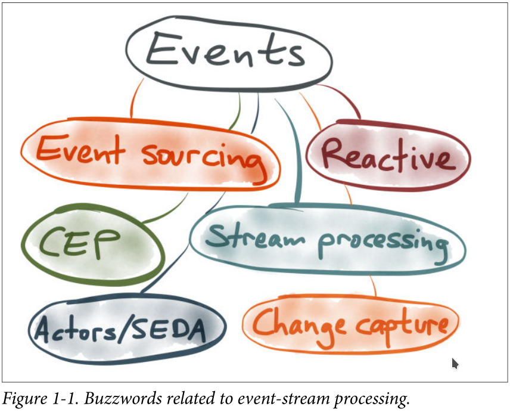
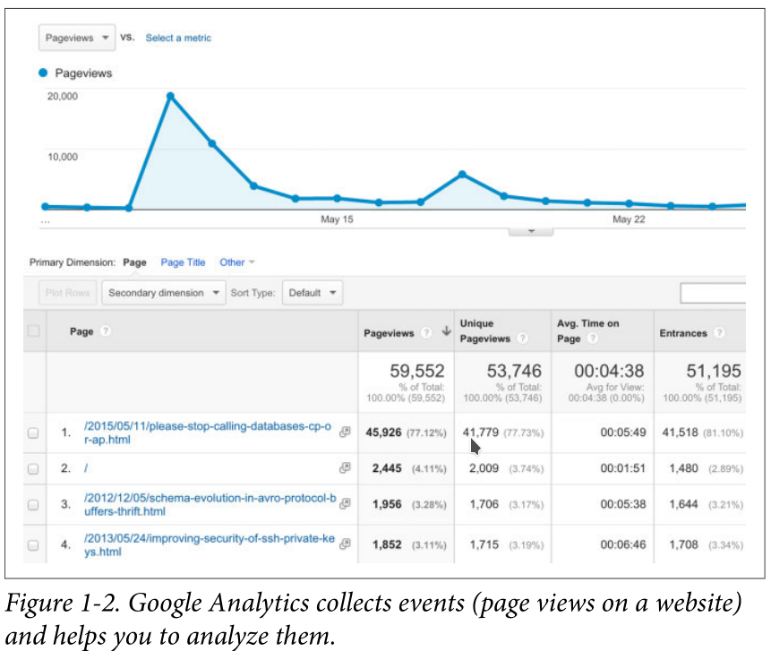
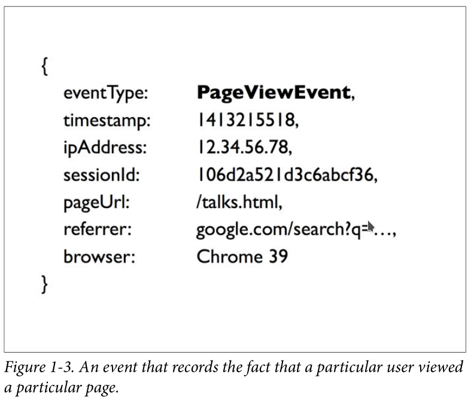
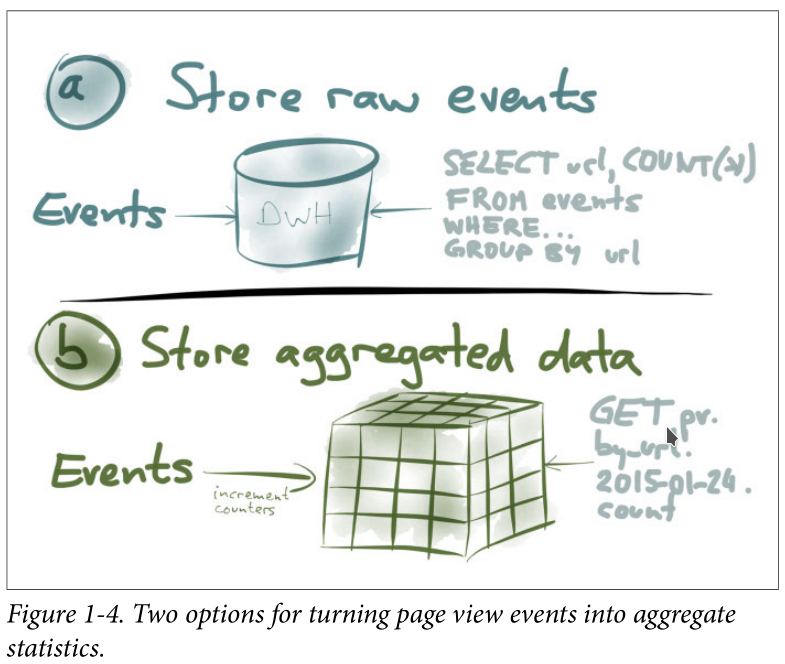
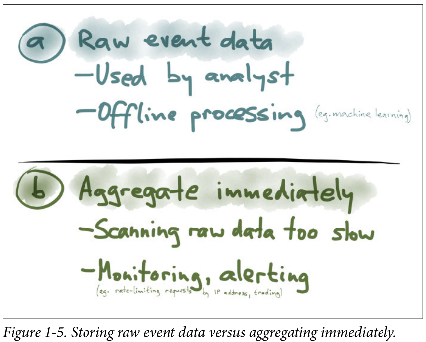

# 第一章:事件和流处理
将结构化数据看做事件流的想法不是什么新东西并且已经被应用到很多领域。在不同的领域中，即使底层原理是相似的，但是它们对应的术语往往不一致，这可能相当令人困惑。当你第一次遇到它时，这些行话可能会令人生畏,但是不要气馁。当你理解它们的本质的时候，这些想法都很简单。

这一章我们将从区分一些术语和基本的思想开始。之后的章节，我们将深入Apache Kafka等特定技术细节并且解释它们设计背后的思想。这将有助于你有效得应用这些技术到你的应用中。

图1-1列出了使用数据流概念的一些技术。部分混乱似乎是因为类似的技术起源于不同的社区，人们似乎常常坚持自己的社区，而不是看看他们的邻居在做什么。

目前用于分布式流处理的工具来自LinkedIn等互联网公司，根源于21世纪初的数据库研究。另一方面，复杂事件处理（CEP）起源于20世纪90年代的事件模拟研究，现在用于企业的运营目的。事件采购源于领域驱动设计（DDD）社区，该社区处理企业软件开发 - 必须使用非常复杂的数据模型但通常比互联网公司更小的数据集。

我的背景互联网公司，但在这里我们将探讨其他社区的行话，并找出共同点和差异。为了使我们的讨论具体化，我将首先介绍流处理领域的一个例子，特别是分析。然后我将与其他领域进行类比。

## Google分析实现：一个案例研究

您可能知道，谷歌分析有点像你可以放在你的网站上的JavaScript，可以跟踪哪些页面已被哪些访客查看过。然后管理员可以浏览此数据，按时间段，URL等信息分析。像图1-2所示

您将如何实施Google Analytics等功能？首先将输入输入系统。每次用户查看页面时，我们都需要记录事件以记录该事实。页面视图事件可能类似于图1-3中的示例（使用一种伪JSON）

一个页面浏览有一个事件类型(PageViewEvent),一个代表事件发生时间的Unix时间戳，客户端的IP地址(这可能是来自cookie的唯一标识符，用来找出同一用户访问的一系列页面)，被访问的页面URL，用户如何到达这个页面的(例如，来自搜索引擎，来自另一个网站的链接)，用户的浏览器和语言设置等等。

注意，每个页面的访问事件是一个简单不可变的事实--简单的记录发生了什么事

现在，您如何从这些页面查看事件转换可以探索人们如何使用您的网站的精美图形仪表板？

从广义上讲，您有两种选择，如图1-4所示

+ 选项a:
你可以简单存储每个进入系统的事件，然后将它们全部转储到大型数据库，数据仓库或Hadoop集群中。现在，只要您想以某种方式分析此数据，就可以针对此数据集运行大型SELECT查询。例如，您可以按URL和按时间段进行分组，也可以按某种条件进行过滤，然后按COUNT（*）来获取每个URL的页面查看次数。这将扫描基本上所有事件，或至少一些大型子集，并动态进行聚合。

+ 选项b:
如果存储每个单个事件对您来说太多，您可以改为存储事件的汇总摘要。例如，如果你正在计算事物，你可以在每次事件进入时增加几个计数器，然后你扔掉实际的事件。您可以在OLAP CUBE(OLAP 多维数据集)中保留多个计数器，想象一个多维多维数据集，其中一个维度是URL，另一个维度是事件的时间，另一个维度是浏览器，依此类推。对于每个事件，您只需要递增该特定URL的计数器，该特定时间，等等。使用OLAP多维数据集时，要查找页面数

使用OLAP多维数据集时，如果要查找特定日期特定URL的页面查看次数，只需阅读该URL和日期组合的计数器即可。您不需要扫描一长串事件 - 这只是读取单个值的问题。

现在，图1-5中的选项a可能听起来有点疯狂，但实际上它的效果非常好。我相信GoogleAnalytics实际上会存储原始事件 - 或者至少是大量事件 - 并在您查看数据时对这些事件执行大扫描。现代分析数据库已经非常适合快速扫描大量数据

存储原始事件数据的最大优势是您可以获得最大的分析灵活性。例如，您可以跟踪一个人在会话过程中访问过的页面序列。如果您将所有事件压缩到计数器中，则无法执行此操作。这种分析对于某些离线处理任务非常重要，例如训练推荐系统（例如，“购买X的人也购买了Y”）。对于这样的用例，最好保留所有原始事件，以便以后可以将它们全部输入到闪亮的新机器学习系统中。

但是，图1-5中的选项（b）也有其用途，特别是当您需要做出决定或实时做出反应时。例如，如果您想阻止人们抓取您的网站，您可以引入速率限制，以便您每小时只允许来自任何特定IP地址的100个请求;如果客户端超出限制，则阻止它。使用原始事件存储实现这一点会非常低效，因为您将不断重新扫描事件历史记录以确定某人是否已超出限制。每个时间窗口保持每个IP地址的页面查看次数计数器更有效率，然后您可以检查每个请求是否超过了

page views per IP address per time window, and then you can check
on every request whether that number has crossed your threshold.
