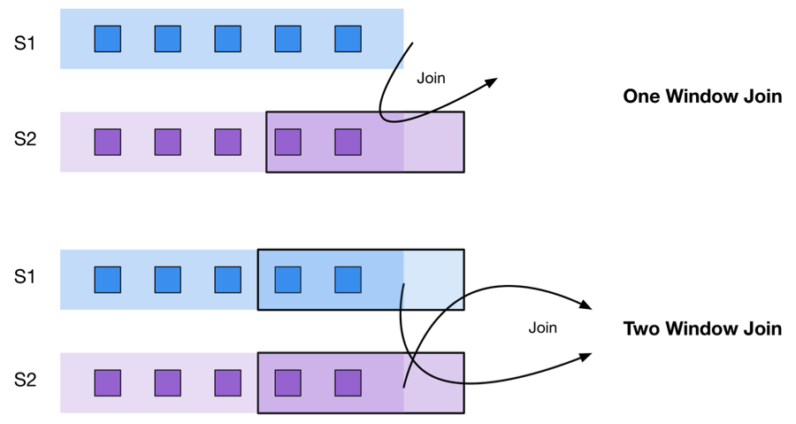

# 流处理101:从SQL到流式SQL[机器翻译]
> 原作者 Srinath Perera [原文链接](https://wso2.com/library/articles/2018/02/stream-processing-101-from-sql-to-streaming-sql-in-ten-minutes/)

我们进入了一个竞争优势来自分析，理解和响应组织数据的时代。当这样做时，时间是至关重要的，速度将决定赢家和输家。

现实情况是，大多数数据的价值随着时间而下降。有趣的是，昨天发生了交通堵塞或10起欺诈事件，或10人心脏病发作。根据这些知识，我们可以学习如何减轻或预防未来的这些事件。但是，如果我们能够在发生这些见解时获得这些见解，那么我们就可以进行干预和管理。

我们中的许多人都经历过及时的数据如何帮助我们自己的生活。假设您正在沿着这条路行驶，突然间，检查引擎灯会亮起来。当然，这很烦人，但是获得早期警告非常有用 - 通常在车辆偏离正常行为或遇到众所周知的故障模式时触发，例如当电池的充电路径不起作用时。幸运的话，你可以转到最近的车库，把它固定好，然后继续前行而不是被困在路上。

汽车制造商已经考虑过这里描述的车辆情景。同样，一些组织正在研究某些用例（例如股票市场，患者监控和监控）如何通过即时访问数据以便及时采取纠正措施而获益。但是，还有许多其他用例尚未经过检查。

多年来，我们尝试使用数据库和批处理技术（如Hadoop和Spark）来分析数据并快速响应以改善结果。这两种技术都非常适合于许多应用，但它们不是快速响应数据的最佳工具。相反，旨在处理需要立即见解的用例的技术称为流处理或流分析。

另一方面，设计用于传递数据的流式传输不是适用于所有情况的工具。对于可以通过单次传递数据进行处理或具有时间局部性（处理倾向于访问最近数据）的用例，流式传输非常有用。相比之下，训练机器学习算法和图形处理都需要多次通过数据集，因此不适合流处理。

本博客介绍了我们可用于流处理的技术。它首先解释第一波流处理工具（如Apache Storm）提供的编程模型及其局限性。然后介绍流式SQL并讨论流式SQL中的关键运算符，同时将它们与SQL进行比较和对比。接下来，我们将探讨如何将机器学习融入流式SQL。然后通过研究流式SQL如何适应组织的分析管道及其部署挑战来得出结论。

## 我们以前如何做流式传输
流处理从流中获取事件，分析它们，并在新流中创建新事件。因此，流处理首先需要一个事件源。它可以是将事件推送给我们的传感器，也可以是定期从源中提取事件的某些代码。此时，一个有用的工具是一个消息队列，您可以将其视为一个存储桶，用于保存在您准备好处理它们之前的事件。我们稍后会谈到这个。

现在你需要对数据做些什么。执行此操作的旧方法是编写将处理与事件源连接起来的代码，然后逐个处理每个事件。事件处理体系结构中的一个有用单元是“actor”或“agent”，它接受事件并产生另一个事件。这样的演员在概念上将一个流转换为另一个流。

为了理解这些想法，让我们考虑一个带有传感器的锅炉，用于测量温度。例如，假设我们想要检测来自锅炉的温度流何时大于350°C。另一个actor可以使用这个新流来创建另一个流。实际上，演员可能会更复杂，接受多个流以产生复合流。当您使用actor连接多个流时，最终会得到一个处理图。事件然后流经图表并产生新事件。

假设我们在锅炉内部和锅炉外的温度流上计算“30秒运行平均值”，并且我们希望在两个温度相隔太远时产生一个事件。计算此查询的图表如下所示。

这里前两个演员需要记住有关早期事件的数据（例如总和和计数）。如果系统出现故障，它将丢失该数据。因此，我们需要构建一种保存和恢复这些状态的方法。

您可以通过使用事件流处理器来节省时间，而不是从头开始编写上述方案。事件流处理器允许您为每个actor编写逻辑，将actor连接起来，并将边连接到数据源。事件流处理器将负责收集数据，将其传递给每个参与者，确保它们以正确的顺序运行，收集结果，在负载高时进行扩展以及处理故障。这是好消息 - 坏消息是有许多流处理器可供选择。例如Apache Storm，Apache Flink和Kafka Streams就是三个。我不打算帮助您选择在这篇文章中使用哪一个。但是，如果你要开始，他们中的任何一个都会这样做。

## 使用SQL流式传输更好
我们假设您选择了一个流处理器，实现了一些用例，并且它正在运行。现在你坐下来品尝胜利。但是，鉴于您在进行批处理时可以简单地编写SQL或SQL之类的东西，为什么还要编写所有这些代码呢？你不应该用SQL做流媒体吗？

答案是肯定的，你应该这样做。这样的流式SQL存在。还有很多产品。一些开源解决方案包括WSO2流处理器，Storm，Flink，Kafka，所有这些都为SQL提供了一些支持。

不幸的是，与SQL不同，没有标准的流式SQL语法。有许多好处，它们遵循SQL但有变化。让我们看看使用两种语言的示例：Siddhi Streaming SQL和Kafka KSQL。

我们用流式SQL编写的锅炉温度用例如下所示。

西提	KSQL
从BoilerStream中选择出价t * 7/5 + 32作为tF [t> 350]	选择出价，t * 7/5 + 32作为来自BoilerStream的tF，其中t> 350
SQL是一种用于查询结构化数据的强大语言。它被设计为一组独立的运算符：投影，过滤，连接和分组，可以重新组合以创建非常强大的查询。其中，前两个运算符与流式SQL的工作方式基本相同。

第一个运算符是projection（aka select），它允许您从流中选择属性的子集并重新整形流。例如，“选择出价”选择锅炉ID字段，“avg（T）为T”重新整形字段T.

第二个运算符是一个过滤器，或者说SQL中的“where子句”，而我们使用的语言（Siddhi）使用更简洁的符号表示“BoilerStream [t> 350]”的where子句。
查询一起要求系统“从BoilerStream中选择其属性”t“大于350的事件，并从每个事件中提取出价并计算tF并将它们放入新流”。

与SQL一样，流式SQL允许我们以声明方式操作流数据，而无需编写代码。以下是流式SQL语言的一些优点：

对于许多了解SQL的人来说，很容易理解和学习。
它富有表现力，简短，甜美，快速！
它定义了涵盖90％问题的核心业务。
流式SQL语言专家可以通过编写扩展来深入了解它们！
查询引擎可以使用流式SQL模型更好地优化执行。大多数优化都已经在SQL下进行了研究，我们可以从数据库优化中借鉴。
让我们来看看一些关键的运营商。就像SQL可以覆盖存储在磁盘中的数据的大多数数据查询一样，流式SQL可以覆盖流式数据上的大多数查询。如果没有流式SQL，程序员就必须手动编写每个操作员的代码，这是非常复杂和艰苦的工作。

SQL中的概念，例如“group by”和“having”子句，通常与流式SQL语言类似。因此，我们不会讨论它们。

Streaming SQL还有两个SQL未涵盖的附加概念：windows和join，它们处理流的复杂性。让我们了解每一个。

## 流式SQL：Windows
在我们到目前为止考虑的用例中，例如过滤器和投影，我们的演员一次只看一个事件。但是，大多数现实世界的用例，例如我们考虑的锅炉温度，都需要某种形式的工作记忆。Streaming通过让用户将工作内存定义为窗口来处理此问题。

您可以将窗口视为流顶部的视图。窗口中的事件保存在内存中，可供操作员进一步处理。

最简单的可用窗口是滑动长度窗口。它将最后N个事件保留在窗口中，并且通常用于计算移动平均值。下图显示了一个滑动窗口。

在文本上，窗口查询如下所示。它主要看起来像SQL，除了指定窗口大小的window语句和“avg（T）”，它告诉如何将数据聚合到一个字段中。

西提	KSQL
选择出价，avg（T）为T From BoilerStream＃window.length（10）插入BoilerStreamMA	选择出价，平均（T）为T From BoilerStream WINDOW HOPPING（SIZE 10，ADVANCE BY 1）
您可能已经注意到，当我提到窗口名称时，我说滑动长度窗口。这里滑动意味着窗口将在每个事件触发输出。另一种选择是批处理，其中窗口仅在批处理结束时触发输出。下图显示了批处理窗口和滑动窗口之间的区别。从窗口信号输出端绘制的箭头。

工作记忆可以根据事件数量（长度窗口）或经过的时间（时间窗口）来定义。这创建了四种组合：

滑动长度窗口 - 为每个新事件保留最后N个事件和触发器。
批长度窗口 - 为每个N事件保留最后N个事件并触发一次。
滑动时间窗口 - 保持在最后N个时间步骤触发的事件和每个新事件的触发器。
批处理时间窗口 - 保持最后N个时间步骤触发的事件，并在结束时间段触发一次。
以上四种是最常见的情况。但是，其他窗口也是可能的。例如，第一个 - 流中的第一个事件，最后一个 - 流中的最后一个事件，会话 - 同一会话中的事件等。

Windows使您能够保持工作记忆并有效地回顾最近的数据。一个常见的用例是移动平均线，它可以平滑数据并跟踪长期趋势。以下是一些其他用例：

移动平均线或中值消除噪音。
多个移动平均线（例如1分钟，5分钟和15分钟）充当趋势方向的指标，并且通常用于股票交易。
股票市场技术分析使用移动平均线的交叉点来检测趋势反转。
在最近事件窗口之上的处理可用于检测异常。
最近窗口的回归可用于预测下一个值预测和趋势。

## 流式SQL：join

如果我们想处理来自多个表的数据，我们在SQL中使用JOIN运算符。同样，如果要处理来自多个流的数据，有两个选项。首先是加入两个并创建一个流，而第二个是跨多个流写入模式。

让我们来探索联接。当我们使用连接时，它在语义上类似于数据库术语中的内连接。

从多个流加入数据的第一个挑战是它们需要在它们到来时对齐，因为它们将具有不同的时间戳。第二个挑战是，由于流是永无止境的，因此连接必须受到限制; 否则加入永远不会结束。第三个挑战是连接需要不断产生结果，因为数据没有结束。

如下图所示，我们通过保持一个窗口并从紫色流中收集事件（在连接中是被动的）然后将蓝色流中的新事件与窗口中的事件相结合来处理此问题。

要了解其工作原理，让我们考虑下面的图6。流S1具有属性“x”和“id”，而流S2具有属性“y”和“id”。我们基于ID属性加入两个流。

使用Siddhi Streaming SQL，连接查询如下所示。

选择x，y从S1作为s1将S2连接为s1.id = s2.id上的s2插入到JoinedStream中

让我们详细探讨它是如何运作的。

如图所示，当e1发生时，它在流S2中发生时被收集在窗口中。
当e2发生时，事件与e1连接并产生一个新事件。
事件e3（在活动流中发生）将被删除，因为它与ID与窗口中的任何事件都不匹配。
事件e4保留在窗口中，因为它在流S2中。
事件e5与窗口中的事件匹配，并生成两个事件作为输出。
事件e6保留在窗口中，并且当窗口大小为2时，删除最旧的事件e1。
事件e7与窗口中的事件匹配，并产生两个事件作为输出。
要使上述模型起作用，必须至少有一个流是有界的，换句话说，必须附加一个窗口。这导致两种情况，如下所示。

第一种情况是我们之前看到的情况，其中一个流（S2）由窗口限制，并且保留在窗口中的事件与来自第二流（S1）的事件匹配。只有第二个流（S2）中的事件才会触发输出。

另一方面，双窗口查询（例如下面描述的）将保留来自窗口中的两个流的事件，并且进入的新事件将触发匹配和输出。

## 流式SQL：应用模式
到目前为止我们讨论的运算符自然地从SQL扩展。虽然窗口是一个新增加的，但它们是对有限工作记忆到永无止境的流的想法的自然适应。下一个想法，模式，超越了SQL，开辟了一组新的用例，这些用例很难用于SQL模型，但在流媒体世界中却很自然且广泛使用。

正如我们已经讨论的那样，流式传输通过在事件中添加时间并接受每个数据点在特定时间点发生来扩展SQL模型（也称为关系模型）。从那时起，考虑事件的顺序是很自然的。

考虑到事件排序，最自然的问题是“事件A后面是事件B吗？”。例如，假设我们想要检测温度是否在五分钟内变化超过20％。要检测到这一点，您需要跟踪最近五分钟的温度，并将它们与每个新事件进行匹配。

“发生在后”关系是各种用例中的关键组成部分。以下是一些用例：

检测值的上升或下降。
检测峰值或谷值。
检测图表模式（即股票市场）。
识别行为签名（例如，步行，跑步）。
检查任务的完整性。（电子邮件的回复是在一小时内发出的吗？）
虽然简单且广泛使用，但使用SQL检测“发生后”模式非常复杂。唯一的方法是尝试连接一个表（或流自身），如果你试图检测多个“发生后”关系，这是非常昂贵和复杂的。

您可能会问，为什么它不是基本SQL的问题？主要有两个原因。首先，时间不是SQL模型的组成部分，因此通常不考虑模式。其次，使用SQL模型很难实现，因此没有人愿意这样做。

Streaming SQL包含一个名为“pattern”的运算符，可以处理这个和类似的用例。

以下查询显示运算符的运行情况。

选择出价，ts为T From BoilerStream为b1 - > BoilerStream [（T - b1.T）/b1.T> 0.2]插入BoilerIncreasedStream

这里“ - >”符号代表“发生后”的关系。下图显示了操作员的工作方式。

它将跟踪每个事件对，以查看“事件A后跟C”是否发生，并在发生时触发并输出。例如，在上述场景中，它触发“AABC”，“ABC”和“AC”，因为那些是“事件A后跟C”的情况。

因此，通过添加模式，流式SQL语言超越了传统的SQL，并启用了一组新的用例，如上所述。

模式实际上比“发生后”关系更强大。

案例1：单个模式查询可以包括多个“关系后发生”实例。

A-> B-> C ^

情况2：查询中的每个元素也可以使用“可选”和任意数量的注释（如正则表达式）进行注释。例如：

A-> B？ - > C表示A任选后接B，然后C

A-> B * - > C表示A，后跟任意数量的B，然后是C.

上面的运算符使它非常强大，让我们使用简单的语法描述非常复杂的模式。

2013年基于分布式事件的系统（DEBS）Grand Challenge中描述的用例提供了流式SQL运行的良好示例。挑战包括一个足球比赛，球，每个球员的靴子和守门员的手套都有传感器，发出的事件包括时间戳，x，y，z位置，速度（vx，vy，vz）和加速度（ax ，ay，az）。

用例描述了流式SQL如何检测每个玩家拥有的球，这可能是其有效性的关键衡量标准。

踢球时检测到的第一个查询。当一名球员和球在一米之内并且球的速度增加到超过55m / s-2时，检测到踢球。这是通过加入玩家流和球流然后检测条件来完成的（有关详细查询，请参阅上面提到的DEBS Grand Challenge参考）。

然后通过寻找另一个玩家的踢，然后是玩家1的一次或多次踢，然后是另一个玩家的踢，来检测对玩家1的占有。虽然条件复杂，但流式SQL的模式运算符只能在两个查询中检测到这两个条件。

就像正则表达式一样，流式SQL模式可以使用流式方式的非确定性有限自动机来实现，并且可以是高性能的。在上述用例中，我们观察到每秒超过十万个事件的性能。

通过流式SQL模式运算符，流式SQL超越了标准SQL，并实现了一系列强大，有效的实际用例，例如物联网（IoT）方案。

## 如何做机器学习
到目前为止我们讨论过的运算符可以处理大多数用例并检测复杂的模式。但是，分析管道中不可忽视的一个常见要求是机器学习。让我们讨论如何将机器学习融入流媒体。

机器学习有几个步骤。首先，我们运行学习算法以从数据集中学习并创建可用于预测新输入结果的模型。将机器学习纳入流式管道的最简单方法是使用批处理构建模型，导出模型，并在流式管道中使用模型。

使用流式传输管道中的模型可以通过两种方式之一完成。

我们可以编写或使用可以运行从特定机器学习平台创建的机器学习模型的扩展。例如，将运行H2O模型的H2O扩展，运行Spark模型的Spark扩展等。
预测模型标记语言（PMML）允许我们将机器学习模型导出为语言中立的XML文档。机器学习框架，例如R，Python scikit-learn或Apache Spark，可以将其某些模型导出为PMML。然后，内置到流引擎中的PMML扩展可以将模型应用于数据流。
机器学习模型方法的一个弱点是模型将随着时间的推移而过时，需要用更新的模型替换。这在机器学习中被称为概念漂移。处理概念漂移需要用户不时交换生产中的模型。这样做很复杂，并且使系统的部署变得复杂。

有一类独立的机器学习算法，称为流机器学习，它可以以流方式学习数据，并在事件进入时更新模型。该技术的一个例子是Apache SAMOA项目。这使用户无需更新模型。然而，这是一个活跃的研究领域，并且当前的技术水平明显不如批量版本准确。因此，该方法目前使用非常有限。

因此，我们需要使用模型方法在管道中使用机器学习。几个流式SQL引擎（例如Siddhi）支持开箱即用。

将流处理安装到分析管道中
最后，让我们探讨流式SQL如何适应系统架构。

最简单的架构如下所示。

用户将查询部署到流处理器中，流处理器侦听事件并生成新的事件流。第二个事件流可以发送到另一个查询，保存到磁盘或附加到执行操作的代码。

如果我们计划运行一个真正的系统，系统故障会产生严重后果，我们需要担心高可用性和可靠性。与我们在面向服务或面向资源的体系结构中遇到的服务不同，流处理器是有状态的。因此，我们需要一个重复的服务器来恢复丢失的状态并确保高可用性（HA）。

这个问题有两种解决方案：

热温高可用性
基于队列的恢复。
通过热 - 高可用性，流处理器并行运行，并将事件发送到两个服务器，但输出从一个服务器中删除。如果主服务器发生故障，则第二个服务器可以从该点开始接管。由于第二台服务器无论如何都会建立状态，因此不会丢失任何状态。

下图显示了设置。

然而，热温高可用性（HA）方法还需要一个步骤。如果节点发生故障，并且辅助节点已接管，则它将继续工作。但是系统现在运行一个节点。因此，我们必须向系统添加替换节点。为此，我们需要能够启动新节点并将辅助节点中的状态同步到新节点，因此新节点可以是新的节点。

使用基于队列的恢复，如下图所示，我们的想法是首先将事件放在消息队列中。然后，流处理器从队列中提取事件，处理它们，并生成新事件。

这里HA由消息队列提供，其中即使流处理器发生故障，消息队列也可以继续接受消息。但是，当发生故障时，状态（例如，窗口中的事件，模式的状态机等）将丢失。要处理此问题，流处理器应定期提供检查点，以读取队列中的位置（游标），状态以及已发送的事件。因此，当流处理器发生故障时，它可以返回并从队列中的最后一个光标位置开始处理，并从检查点获取相应的状态并继续。

是否使用热暖HA或基于队列的恢复的决定将取决于用例。热暖HA的优点是您可以只使用两个节点来获得HA系统，并且设置简单。最小的HA设置通常可以每秒处理数万个事件。所有用例中约80％至90％可以这种方式处理。但是，这种方法的扩展性很差，因为如果用N个节点完成工作，系统需要2N节点进行扩展。

相比之下，基于队列的恢复设置很复杂，最小HA设置需要五个节点。您需要一个消息队列（JMS代理或Kafka），数据库和处理节点。对于消息队列和数据库，您需要设置HA版本。如果选择使用JMS代理，则每秒可以获得大约5,000条带有两个节点的消息。如果选择Kafka，最小部署需要大约五个节点（四个zookeeper节点加一个Kafka节点），并且每秒可以执行数十万个事件。这种方法更好地扩展。如果可以使用N个节点完成工作，则系统仅需要N + 4个节点。

总之，如果您有小型或中型工作负载，那么热门HA会更好，因为它提供了一个带有两个节点的简单部署。但是，在具有较高事件发生率的情况下，在每秒20,000个事件的平均值中超过平均值，基于队列的恢复提供了更好的方法。

结论
许多用例需要快速，实时的决策。虽然可以使用数据库或批处理来实现它们，但这些技术很快就会引入复杂性，因为用例和使用的工具之间存在基本的阻抗不匹配。相比之下，流式传输提供了一种更自然的模型来思考，捕获和实现这些实时流式使用案例。Streaming SQL提供了一种简单但功能强大的语言来编写流式用例。

通过应用本博客中描述的方法，我相信您会对使用SQL的强大用例感到惊喜。要了解更多信息，建议您查看文章“Streaming Real-time Analytics模式”，其中介绍了流式SQL可能实现的模式和用例。此外，您可以通过下载WSO2流处理器来试用样本并使用流式SQL进行播放。它可以通过https://wso2.com/analytics上的Apache License 2.0免费获得。
